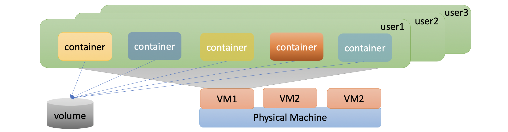
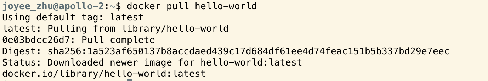
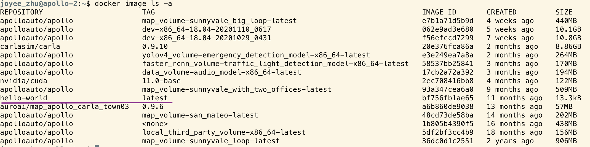
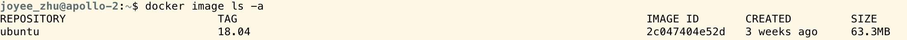

#VMC Docker Container 

This article contains the following sections:

* Concepts
* Get Docker Image
* Create Container


## Concepts
* ***Image***  Docker image is static and unchangeable once it’s written.   It’s like burning the CD or DVD.  Once the CD or DVD is burned, everything inside is fixed.
* ***Container***  Docker container is instance of one image.  
* ***Create one Container***  It’s like you inserted one CD into the virtual computer and loaded all content of image into computer’s memory.  But the virtual computer is not up and running until container is started 
* ***Start/Stop one container***  Power on/off the virtual computer
* Docker HUB.  The globally accessible repository for sharing images

### Advantages for using container technology for VMC:




* Each individual user can create as many containers as they want
* Each individual user can always get root permission once they are sitting inside their own containers.  This is very important because env setup usually requires root permission
* Each individual user can choose whatever Linux packages they would like to install or uninstall
* Once thing’s going wrong in the container, don’t need to worry. Delete the container and then create a new one
* Once thing’s going well.  Save the good container to disk and it becomes another image which can be used for future or shared with other team members
* The knowledge you gain in the container is 99% as the same you gain while you are working in the physical machine or Virtual Machine (VM)


## Get Docker Image  

User can pull out docker images __`docker pull <image_name>`__ from Docker Hub, which functions the download of the requested images to the local hard-disk.



Then you can use __`docker image ls -a`__ to check whether you have the local copy of the image



Simliarly, you can pull out the OS images from docker hub.

```
docker pull ubuntu:18.04
docker image ls -a
```


## Create Container

***MUST READ THE FOLLOW PARAGRAPH BEFORE MOVING ON***

At very beginning, we would like to make one point <span style="color:red">***VERY CLEAR***</span> and it's also <span style="color:red">***VERY IMPORTANT***</span> for all the users in VMC who are or will be working on docker containers.  That is <span style="color:red">***Be Extremely Careful***</span> to manipulate containers, especially the __`docker container rm <container_name>`__ operation.  The main reason is we are using ***Docker CE*** instead of ***Docker EE*** (because Docker CE is free).  As so, the containers one user would create would be visible and accessible for other users.  In other words, the containers created by one user are not protected by the permission control which Linux system enforces by default.  As so, we would like to set up the following rules to help VMC to ease the maintenance of docker containers.

* ***Docker Container Creation***

Please use __`vmc_dc_start.sh -n <container_name> -i <image_name> -t <image_tag>`__ to start a new container.  This command prefixes the container name with users' login id.  Then user can easily identify container's ownership by using name.

```
vmc_dc_start.sh -i ubuntu -t 18.04 -n abc
```

```
docker container ls -a

bash-3.2$ docker container ls -a
CONTAINER ID   IMAGE          COMMAND       CREATED         STATUS         PORTS     NAMES
b9f2e49bdfd2   ubuntu:18.04   "/bin/bash"   3 minutes ago   Up 3 minutes             joyeez_abc 
```  

* ***Docker Container Deletion***

Do not directly use container deletion command __`docker container rm <container_name>`__.  Instead, please use __`vmc_dc_rm.sh -n <container_name>`__, which matches the user ID before the deletion, otherwise cancels the deletion.

```
bash-3.2$ vmc_dc_rm.sh -n joyeez_abc
-I- Now stop container joyeez_abc ...
-I- Done.
```

* ***Login Docker Container***

Use command __`vmc_dc_enter.sh -n <container_name>`__ to login one container.  This command always enter the container by using the user's linux id, instead of as root (Remember: all the users inside containers can be root by using command __`sudo -i`__).

```
bash-3.2$ vmc_dc_enter.sh -n joyeez_abc
joyeez@joyeez_abc:~$
```  


